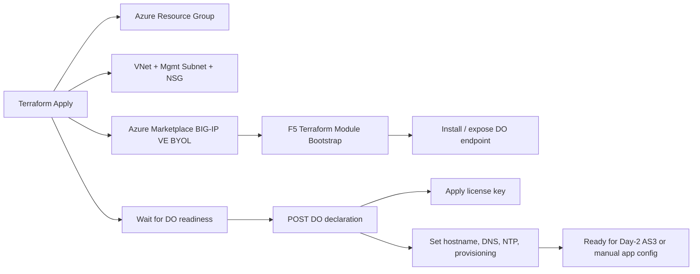

# Reference Architecture

## Fastest Fully Automated Pattern

The fastest fully automated Azure deployment pattern for BIG-IP is:

`Terraform -> Azure Marketplace BIG-IP BYOL image -> F5 module bootstrap -> Declarative Onboarding POST`

Why this is fastest:

- no portal clicks after initial variable setup
- no manual licensing step
- no manual SSH or GUI onboarding
- minimal Azure components
- easy to rerun for labs, demos, and customer PoCs

## Deployment Flow

## Components

- `Terraform`: orchestrates Azure infrastructure and onboarding steps
- `Azure Marketplace BIG-IP BYOL image`: boots the BIG-IP VE instance
- `F5 Terraform module`: accelerates BIG-IP VM and bootstrap creation
- `Declarative Onboarding (DO)`: licenses and configures base BIG-IP services
- `Azure NSG`: allows management access and REST onboarding traffic

## Why I Built The Plan As 1-NIC

For a true fastest-path deployment, 1-NIC is simpler than 3-NIC or HA because it avoids:

- extra route tables
- additional NIC mapping validation
- self IP / VLAN interface ambiguity during first deployment
- failover extension setup

It is the best fit for:

- evaluation environments
- lab builds
- customer demos
- API validation and onboarding testing

## Day-2 Upgrade Path

Once the 1-NIC plan is working, the normal next step is:

1. Move to 3-NIC standalone
2. Add AS3 declarations for applications
3. Add Cloud Failover Extension for HA
4. Move secrets to Key Vault
5. Put the plan into CI/CD
